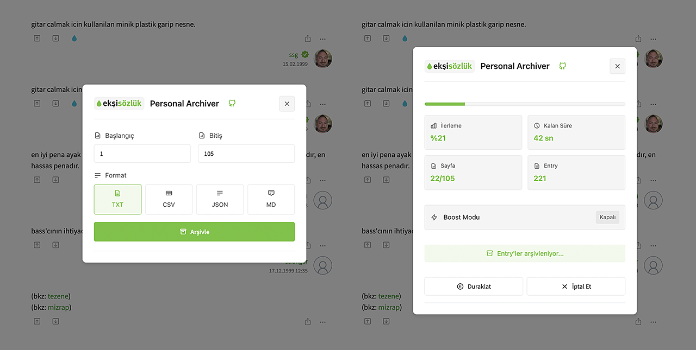

# Ekşi Sözlük Personal Archiver (ESPA)

Ekşi Sözlük'teki entry'leri kişisel arşivleme amacıyla kaydetmenize yardımcı olan bir userscript.



## Özellikler

- Entry'leri kişisel arşiv için arşivleme
- Arşivleme için çoklu format desteği (TXT, CSV, JSON, Markdown)
- İlerleme göstergesi ve kalan süre tahmini
- Duraklat/Devam Et özelliği
- Boost modu
- Entry'lerdeki bağlantıları otomatik algılama
- Modern ve kullanıcı dostu arayüz

## Dosya Formatları ve Kullanım Alanları

### TXT (Metin Dosyası)
- Basit ve evrensel okuma/yazma desteği
- Tüm metin editörleriyle uyumlu
- Düşük depolama alanı kullanımı
- Hızlı açılma ve işlenme
- Offline okuma için ideal

### CSV (Comma Separated Values)
- Veri analizi ve istatistik çalışmaları için uygun
- Excel, Google Sheets gibi programlarla uyumlu
- Yapılandırılmış veri formatı
- Büyük veri setleri için ideal
- Makine öğrenmesi projeleri için veri seti oluşturma

### JSON (JavaScript Object Notation)
- Programatik işlemler için ideal
- Web API'ları ile kolay entegrasyon
- Veri yapısını koruma
- Nesne tabanlı programlama için uygun
- Veri madenciliği projeleri için tercih edilen format

### Markdown (MD)
- Zengin metin formatlaması
- GitHub ve benzeri platformlarda düzgün görüntüleme
- Blog yazıları için hazır format
- Dokümantasyon oluşturma
- Web içeriğine kolay dönüştürme

## Entry Yapısı ve Formatlar

### TXT Formatı
```txt
[Başlık] örnek-baslik--123456
[Tarih] 14.01.2024 15:30
[Yazar] yazaradi
[Entry] Entry içeriği buraya gelir...
[Linkler] (varsa)
- https://eksisozluk.com/python--109082
- https://github.com/python/cpython
- https://www.python.org/doc/

[Başlık] örnek-baslik--123456
[Tarih] 14.01.2024 15:31
[Yazar] yazaradi2
[Entry] İkinci entry içeriği...
[Linkler] (varsa)
- https://tr.wikipedia.org/wiki/Python
```

### CSV Formatı
```csv
başlık,tarih,yazar,entry,linkler
"örnek-baslik--123456","14.01.2024 15:30","yazaradi","Entry içeriği buraya gelir...","https://eksisozluk.com/python--109082, https://github.com/python/cpython, https://www.python.org/doc/"
"örnek-baslik--123456","14.01.2024 15:31","yazaradi2","İkinci entry içeriği...","https://tr.wikipedia.org/wiki/Python"
```

### JSON Formatı
```json
{
  "başlık": "örnek-baslik--123456",
  "entry'ler": [
    {
      "tarih": "14.01.2024 15:30",
      "yazar": "yazaradi",
      "entry": "Entry içeriği buraya gelir...",
      "linkler": [
        "https://eksisozluk.com/python--109082",
        "https://github.com/python/cpython",
        "https://www.python.org/doc/"
      ]
    },
    {
      "tarih": "14.01.2024 15:31",
      "yazar": "yazaradi2",
      "entry": "İkinci entry içeriği...",
      "linkler": [
        "https://tr.wikipedia.org/wiki/Python"
      ]
    }
  ]
}
```

### Markdown Formatı
```markdown
# örnek-baslik--123456

## Entry 1
**Yazar:** yazaradi  
**Tarih:** 14.01.2024 15:30

Entry içeriği buraya gelir...

**Linkler:** (varsa)  
- [Python (Ekşi Sözlük)](https://eksisozluk.com/python--109082)
- [Python GitHub](https://github.com/python/cpython)
- [Python Dokümantasyon](https://www.python.org/doc/)

## Entry 2
**Yazar:** yazaradi2  
**Tarih:** 14.01.2024 15:31

İkinci entry içeriği...

**Linkler:** (varsa)  
- [Python - Vikipedi](https://tr.wikipedia.org/wiki/Python)
```

## Dosya İsimlendirme ve Kaydetme

### Dosya Adı Formatı
- Dosya adı şablonu: `[slug-url]-[tarih].[uzantı]`
- Entry'nin tam URL'si (başlık ve ID dahil) korunur
- Örnek: `turk-aksani-ile-ingilizce-konusmak--3560073-20240114-1530.txt`

### Örnekler
1. Normal başlık:
   - URL: `eksisozluk.com/yazilimcilik-hakkinda--123456`
   - Dosya: `yazilimcilik-hakkinda--123456-20240114-1530.txt`

### Desteklenen Formatlar ve Uzantılar
- TXT dosyaları: `.txt`
- CSV dosyaları: `.csv`
- JSON dosyaları: `.json`
- Markdown dosyaları: `.md`

## Kullanım Alanları

### Akademik ve Araştırma
- Sosyal bilimler araştırmaları için veri toplama
- Dijital sosyoloji çalışmaları
- Dil bilimi ve söylem analizi
- Toplumsal hafıza araştırmaları
- Güncel olayların toplumsal yansımalarını inceleme

### Yapay Zeka ve Veri Bilimi
- Doğal dil işleme modelleri için Türkçe veri seti oluşturma
- Duygu analizi (sentiment analysis) ve toplumsal algı çalışmaları
- Makine öğrenmesi modelleri için eğitim verisi hazırlama
- Türkçe dil modelleri geliştirme
- Semantik analiz ve metin madenciliği araştırmaları

### Kişisel Gelişim ve Öğrenme
- İlgilendiğiniz konularda bilgi arşivi oluşturma
- Öğrenme materyalleri derleme
- Kişisel not ve referans kütüphanesi oluşturma
- Favori yazarların entry'lerini saklama
- Önemli tartışmaları arşivleme

### Araştırma ve İnceleme
- Belirli konulardaki görüşleri derleme
- Tarihsel olayların toplumsal algısını inceleme
- Kavramların zaman içindeki değişimini takip etme
- Kültürel değişimleri gözlemleme
- Toplumsal eğilimleri analiz etme

### Kişisel Arşiv
- Offline okuma koleksiyonu oluşturma
- İlham verici entry'leri saklama
- Önemli bilgileri yedekleme
- Kişisel okuma listesi hazırlama
- İlgilendiğiniz başlıkları arşivleme

## Kurulum

1. Tarayıcınıza aşağıdaki eklentilerden birini kurun:
   - [Tampermonkey](https://www.tampermonkey.net/) (Chrome, Firefox, Safari, Edge için)
   - [Greasemonkey](https://addons.mozilla.org/en-US/firefox/addon/greasemonkey/) (Firefox için)
   - [Violentmonkey](https://violentmonkey.github.io/) (Chrome, Firefox, Edge için)
2. [Buraya tıklayarak](https://github.com/hasanbeder/ESPA/raw/main/ESPA.user.js) scripti yükleyin
3. Eklenti kurulum penceresinde "Yükle" butonuna tıklayın

## Kullanım

1. Ekşi Sözlük'te herhangi bir başlığa gidin
2. Başlık yanındaki arşivleme ikonuna tıklayın
3. İstediğiniz sayfa aralığını ve format tercihini seçin
4. "Arşivle" butonuna tıklayın

## Önemli Yasal Uyarı

### Lisans ve Amaç Bildirimi
Bu script:
- GNU General Public License v3.0 (GPLv3) altında dağıtılan, açık kaynak kodlu bir eğitim projesidir
- Ekşi Sözlük'ün resmi bir ürünü değildir ve Ekşi Sözlük ile herhangi bir bağlantısı bulunmamaktadır
- Tamamen eğitim, araştırm ve **kişisel arşivleme** amaçlı geliştirilmiştir
- Normal kullanıcı davranışını simüle eder ve zararlı hiçbir işlem gerçekleştirmez

### Önemli Kısıtlamalar
Bu script ile arşivlenen içerikler:
- Kesinlikle herhangi bir ortamda yayınlanamaz veya dağıtılamaz
- Sadece kişisel kullanım için arşivlenebilir
- Ticari amaçla kullanılamaz
- Başka platformlarda paylaşılamaz
- Toplu olarak kopyalanamaz ve çoğaltılamaz
- 18 yaş altındaki kişiler tarafından kullanılamaz

### Kullanıcı Sorumlulukları
Bu script'i yükleyerek ve kullanarak:
- Ekşi Sözlük'ün gizlilik politikasına ve kullanım koşullarına uyma sorumluluğunun tamamen size ait olduğunu,
- Script'in kullanımından doğabilecek her türlü yasal sorumluluğun size ait olduğunu,
- Elde edilen verilerin kullanımında telif hakları ve kişisel verilerin korunması kanunlarına uyacağınızı,
- Bu aracı kötüye kullanmayacağınızı ve Ekşi Sözlük'ün altyapısına zarar verecek şekilde kullanmayacağınızı,
- Arşivlenen içeriği KESİNLİKLE yayınlamayacağınızı ve dağıtmayacağınızı,
- Verileri SADECE kişisel kullanım için saklayacağınızı,
- Script'i kullanmadan önce Ekşi Sözlük'ün gizlilik politikasını ve kullanım koşullarını okuduğunuzu ve kabul ettiğinizi

kabul ve beyan etmiş sayılırsınız.

### Etik Kullanım İlkeleri
1. İçeriği SADECE kişisel kullanım için arşivleyin
2. Telif haklarına ve kişisel verilerin gizliliğine saygı gösterin
3. Entry'leri yazarlarının haklarına saygı göstererek kullanın
4. Ekşi Sözlük'ün normal işleyişini engellemeyecek şekilde kullanın
5. Arşivlenen içeriği başka platformlarda paylaşmayın
6. Boost modunu makul sınırlar içinde kullanın

## Gereksinimler

### Tarayıcı Gereksinimleri
- Modern bir web tarayıcısı:
  - Google Chrome
  - Mozilla Firefox
  - Microsoft Edge
  - Safari
  - Opera

### Userscript Yöneticisi
Aşağıdaki userscript yöneticilerinden birinin güncel sürümünün kurulu olması gerekir:
- Tampermonkey (önerilen)
  - En güncel özellikleri destekler
  - Tüm modern tarayıcılarla uyumludur
  - Otomatik güncelleme özelliği sunar
- Violentmonkey
  - Açık kaynak bir alternatiftir
  - Tüm modern tarayıcılarla uyumludur
- Greasemonkey
  - Firefox'ta daha iyi performans sağlar
  - Firefox'a özel özellikler sunar

### Sistem Gereksinimleri
- İşletim Sistemi: Windows 7+, macOS 10.13+, Linux (güncel dağıtımlar)
- RAM: Modern bir tarayıcının çalışabildiği herhangi bir sistem yeterlidir
- Depolama: Arşivlenecek entry sayısına ve içeriklerine göre değişkenlik gösterir

### İnternet Bağlantısı
- Minimum: 1 Mbps
- Önerilen: 5+ Mbps
- Not: Boost modu için daha yüksek hız önerilir

### Tarayıcı Ayarları
- JavaScript'in etkin olması gerekir
- Desteklenen userscript yöneticilerinden biri kurulu olmalıdır (yukarıdaki "Gereksinimler" bölümüne bakınız)

### Ekşi Sözlük Erişimi
- Ekşi Sözlük'ün çalışır durumda olması
- Entry'lerin herkese açık olması (gizli/silinmiş entry'ler arşivlenemez)
- Çok yoğun kullanımda geçici IP kısıtlaması alınabilir

## Katkıda Bulunma

Katkıda bulunmak için lütfen [CONTRIBUTING.md](CONTRIBUTING.md) dosyasını inceleyin.

## Lisans

Bu proje GNU General Public License v3.0 (GPLv3) altında lisanslanmıştır. Bu lisans:
- Yazılımı kullanma, değiştirme ve dağıtma özgürlüğü verir
- Tüm değişikliklerin ve türev çalışmaların da aynı lisans altında dağıtılmasını zorunlu kılar
- Kaynak kodun her zaman açık ve erişilebilir olmasını sağlar
- Kullanıcıların haklarını korur ve yazılımın özgür kalmasını garanti eder

Detaylar için [LICENSE](LICENSE) dosyasına bakın.

## İletişim

- GitHub: [@hasanbeder](https://github.com/hasanbeder)
- X (Twitter): [@hasanbeder](https://x.com/hasanbeder)
- Issue: [Issue sayfası](https://github.com/hasanbeder/ESPA/issues)
